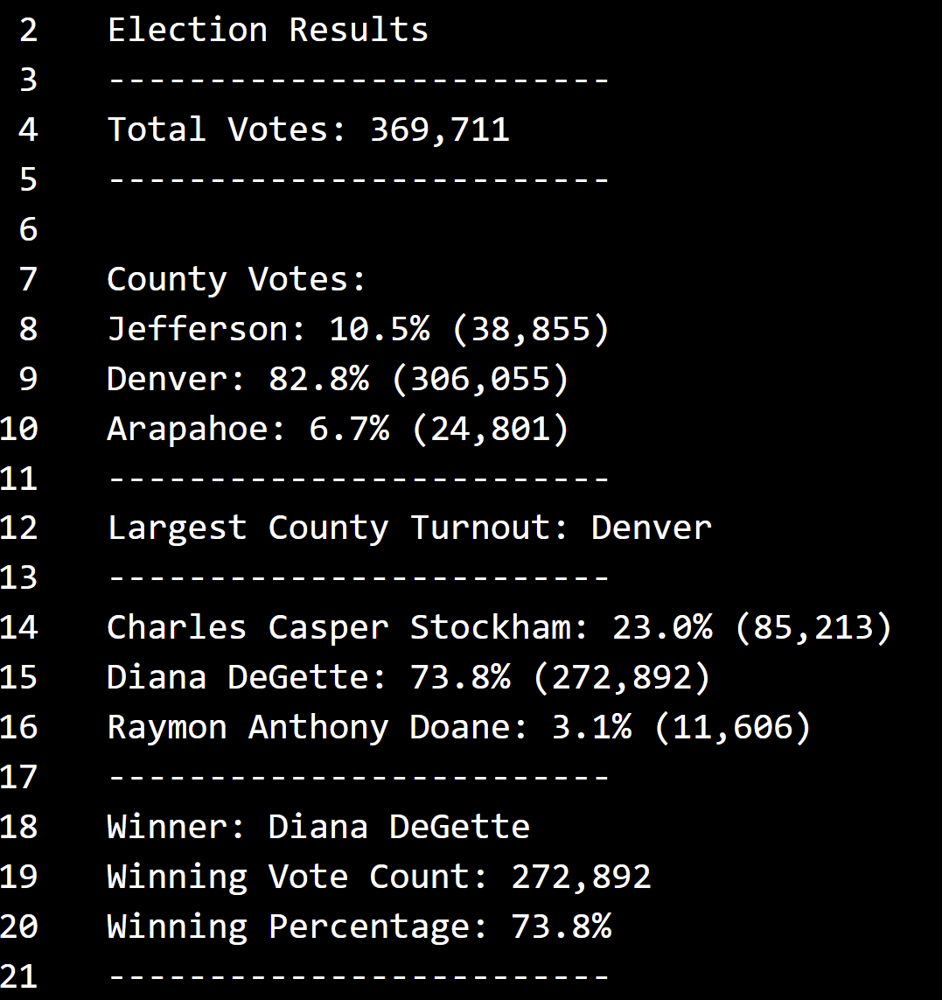

# Election_Analysis
## Purpose

The purpose of this analysis was to take election data and agregate it to determine who won the election and what counties contrubited most to that win. It can also help determine which counties have the highest rates of voting in general, helping future canidates in targeted campaigning. 

## Election Audit Results:
### How many votes were cast in this congressional election?

A total of 369,711 votes were cast in this election.
### Provide a breakdown of the number of votes and the percentage of total votes for each county in the precinct.

There are three main counties in this precinct. Jefferson (38,855 votes and 10.5%), Denver (306,055 votes and 82.8%), and Arapahoe (24.801 votes and 6.7%)
### Which county had the largest number of votes?

Denver had the largest number of votes with 306,055 votes. 
### Provide a breakdown of the number of votes and the percentage of the total votes each candidate received.

The three canadates were Charles Casper Stockham (85,213 votes and 23.0%), Diana DeGette (272,892 votes and 73.8%), and Raymon Anthony Doane (11,606 votes amd 3.1%)
### Which candidate won the election, what was their vote count, and what was their percentage of the total votes?

Diana DeGette won the election. Their vote count was 272,892 with a percentage of 73.8%.

Data from the terminal:

Data from the txt: 

## Election Audit Summary
This code can be used to determine who won an election and where the highest number of votes were coming from. 

A modification can be a more detailed analysis, trying to determine how each county voted. Which means we would determine the rates of each canidate in each county. This is benifical as in the future canidates may be able to do more pointed campaigning. 

This script can be modified to provide other characteristics, instead of just county and canidate. These characteristics can be any form of demographic data (race, sex, age, ect.) or who the individual had previously voted for, assuming that this data is in the original data set. 

